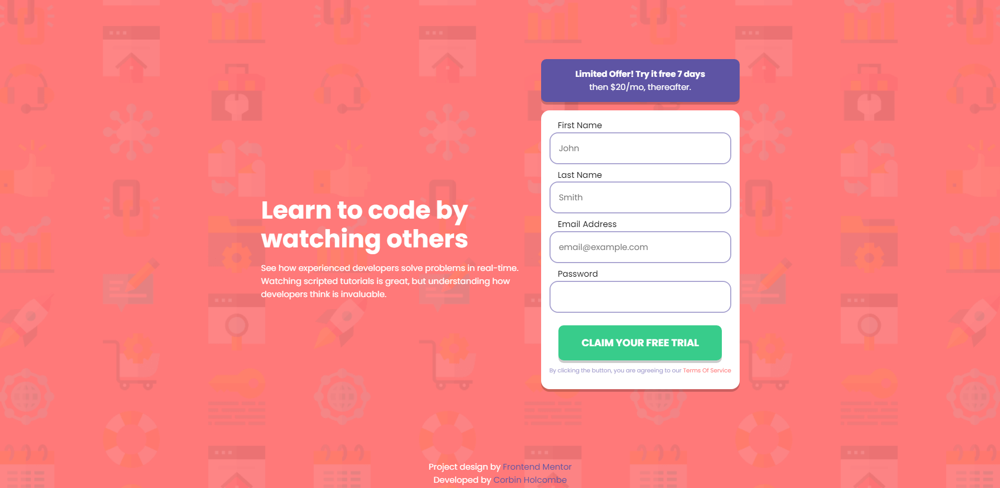
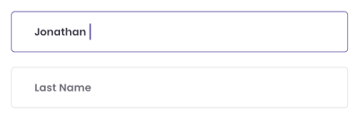
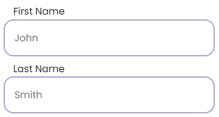

# Intro Page with Sign-Up Form


## Overview
This project is my take on the [challenge created by Frontend Mentor](https://www.frontendmentor.io/challenges/intro-component-with-signup-form-5cf91bd49edda32581d28fd1). It tests my *HTML*, *CSS Flexbox*, and *responsive design skills* by turning a provided design into a functional, interactive intro page with a sign-up form. I also integrated basic *JavaScript* form validation and added feedback animations.


## Skills Practiced
- Responsive Web Design with CSS Flexbox
- Mobile First Development
- Javascript and Basic Regex for Form Validation
- Utilizing Figma file to plan

## Tools & Technologies
- HTML5
- CSS3 (CSS Flexbox)
- Vanilla Javascript
- Figma (Figma file provided by Frontend Mentor)

## Viewing The Product
You can view the live version of the project by visiting [this link](https://corbinhol.github.io/Intro-Page-with-Sign-Up-Panel/). Alternatively, if you have git installed, you can clone the repository and view it locally from any browser of your choice by opening index.html.
```
git clone https://github.com/Corbinhol/Intro-Page-with-Sign-Up-Panel
cd Intro-Page-with-Sign-Up-Panel
```
## Challenges
I initially struggled with the mobile-first workflow, but the simpler design helped ease the process. Handling the background image was challenging—it was quite large and caused the page to expand. I learned to wrap background images in a container div to control overflow and ensure the image is properly sized and positioned (e.g., set at 0,0 and stretched both horizontally and vertically).

## Lessons Learned
- Generalizing CSS classes can save time and streamline the styling process.
- Using basic Regex for email validation helped solidify my understanding of form checks.
- Leveraging the “input” event in JavaScript allowed me to dynamically respond whenever the user changed their input.

## Changes I made
To improve accessibility, I moved the form input labels from inside the fields to above them. Instead of placeholders, I used example inputs. This helps screen readers interpret the form more effectively.

Version that was displayed in their figma file:


My Adjusted Version:



## Acknowledgments
The original project was built by [Frontend Mentor](https://www.frontendmentor.io/home), you can visit the project page here. Their templates provide a fantastic way to practice and improve web development skills.

## Improvements I could make
Running the webpage through an accessibility audit showed me that I should change the colors to make it WCAG Contrast Ratio Compliant. Additionally, I should work to improve the readability of the Hyperlinks on my page.

## Next Steps
I plan to move on to another Frontend Mentor Template. However, if I continued this project I would add improved form validation (valididating First name, last name, and password requirements). I would like to learn how to write a backend server and possibly a database for a website like this to interact with.


